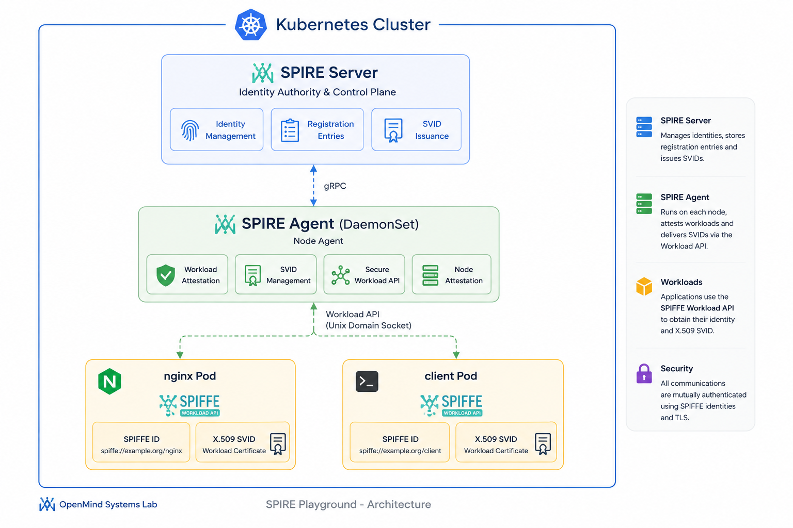

  

<h1 align="center">SPIRE Playground (Kubernetes + CRD Mode)</h1>

A hands-on lab for deploying and experimenting with SPIRE on Kubernetes using the modern CRD-based model (ClusterSPIFFEID).

---

## 📖 Overview

This lab demonstrates:

- 🧷 SPIRE deployed on Kubernetes
- 🧩 Modern CRD mode (ClusterSPIFFEID)
- 🔐 Automatic SPIFFE identity issuance
- 🧪 Workload attestation (client + nginx)

It replaces the legacy manual `spire-server entry` workflow with a Kubernetes-native approach.

## 🚀 Architecture

---

## 🚀 Lab Goals

- Understand SPIRE architecture in Kubernetes
- Use `ClusterSPIFFEID` instead of static entries
- Observe automatic SPIFFE identity assignment
- Validate workload identity for client and nginx pods

---

## 🏗️ 1. Install SPIRE (Helm)

### 📦 Add Helm repository

helm repo add spiffe https://spiffe.github.io/helm-charts-hardened/
helm repo update

---

### 🧱 Install SPIRE CRDs

helm upgrade --install spire-crds spire-crds \
  --repo https://spiffe.github.io/helm-charts-hardened/ \
  --namespace spire-system \
  --create-namespace

---

### ⚙️ Install SPIRE core components

helm upgrade --install spire spire \
  --repo https://spiffe.github.io/helm-charts-hardened/ \
  --namespace spire-system

---

## 🔍 2. Verify installation

kubectl get pods -n spire-system
kubectl get csidrivers
kubectl get clusterspiffeid

---

## 🧷 3. CRD-based model (IMPORTANT)

You no longer create `spire-server entry create` manually.

Instead, you use:

- ClusterSPIFFEID

Apply manifests:

kubectl apply -f manifests/client-spiffeid.yaml
kubectl apply -f manifests/nginx-spiffeid.yaml

---

## 🧩 4. ClusterSPIFFEID examples

### 👤 Client

apiVersion: spire.spiffe.io/v1alpha1
kind: ClusterSPIFFEID
metadata:
  name: client
spec:
  spiffeIDTemplate: "spiffe://example.org/ns/spire-playground/sa/client"
  podSelector:
    matchLabels:
      app: client
  workloadSelectorTemplates:
    - "k8s:ns:spire-playground"
    - "k8s:sa:client"

---

### 🌐 Nginx

apiVersion: spire.spiffe.io/v1alpha1
kind: ClusterSPIFFEID
metadata:
  name: nginx
spec:
  spiffeIDTemplate: "spiffe://example.org/ns/spire-playground/sa/nginx"
  podSelector:
    matchLabels:
      app: nginx
  workloadSelectorTemplates:
    - "k8s:ns:spire-playground"
    - "k8s:sa:nginx"

---

## 🚀 5. Deploy workloads

kubectl apply -f manifests/

---

## 🔐 6. Verify SPIFFE identity

kubectl get pods -n spire-playground

kubectl exec -it -n spire-playground client -- ls /spiffe-workload-api

---

## 🧠 7. How SPIRE assigns identities

SPIRE works as follows:

1. Pod attestation via CSI driver
2. Selector matching:
   - namespace
   - serviceAccount
   - pod UID (legacy mode)
   - ClusterSPIFFEID (recommended)
3. If match → SVID is issued

The SPIRE Agent enforces identity.

---

## ⚠️ 8. Legacy vs CRD mode

### ❌ Legacy mode

spire-server entry create ...

- manual
- fragile
- not Kubernetes-native

---

### ✅ CRD mode (recommended)

kubectl apply -f clusterspiffeid.yaml

- dynamic
- declarative
- Kubernetes-native

---

## 🧹 9. Clean up legacy entries

kubectl exec -it -n spire-system statefulset/spire-server -- spire-server entry show

kubectl exec -it -n spire-system statefulset/spire-server -- \
spire-server entry delete -entryID <ID>

---

## 🔁 10. Restart & debug

kubectl rollout restart daemonset spire-agent -n spire-system
kubectl delete pod -n spire-playground --all

---

## 🧪 11. Debug SPIRE agent

kubectl logs -n spire-system daemonset/spire-agent

---

## 🎯 Expected result

client -> spiffe://example.org/ns/spire-playground/sa/client
nginx -> spiffe://example.org/ns/spire-playground/sa/nginx

---

## 🧭 Conclusion

- SPIRE = workload identity via attestation
- CRD mode = Kubernetes-native identity model
- Entries = legacy approach

---

## 📚 References

- https://spiffe.io/docs/latest/
- https://spiffe.io/docs/latest/spire/
- https://spiffe.io/docs/latest/spire/k8s/

---

## 🏛 About OpenMind Systems Lab

OpenMind Systems Lab is an independent French non-profit association dedicated to research, experimental development and technical benchmarking in Cloud Native technologies.

Our mission is to produce practical, reproducible and educational Open Source Proofs of Concept covering Kubernetes, Platform Engineering, Distributed Messaging, Infrastructure Security and Artificial Intelligence.

GitHub Organization:

https://github.com/openmind-systems-lab

---

Made with ❤️ by OpenMind Systems Lab

